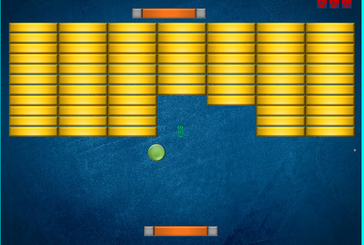

# Brick-Breaker-Game
Simple Brick Breaker Game
## About
The Brick Breaker game implemented in Java . using OOP concepts such as  Factory pattern & Decorator Design Pattern, <br>
polymorphism & interfaces .<br>
The project divided to packages and classes according to different brick strategies and game objects.<br>
<!-- brick strategies package:<br> 
AddBallStrategie, AddNewPaddleStrategie, AddSpeedStrategie, MultipleBehaviorStrategy <br>
RemoveBrickStrategy, WideOrNarrowStrategy <br>
BrickStrategyFactory (Factory), CollisionStrategy (interface)
-->
## Requirements
Java version 10 or higher <br>
Download DanoGameLab.zip external library from [here](https://danthe1st.itch.io/danogamelab)

## Running the project
1. Download this project to your computer using cmd
```sh
git clone https://github.com/mulugetaf/Brick-Breaker-Game.git
```
2. Imported it in [Intellij IDEA](https://www.jetbrains.com/idea/download/#section=windows) or any other Java IDE.
3. Import DanoGameLab.jar
4. Run the application and start play

## Screenshot

